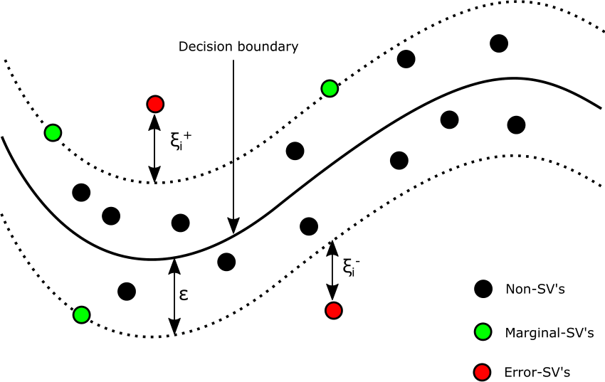
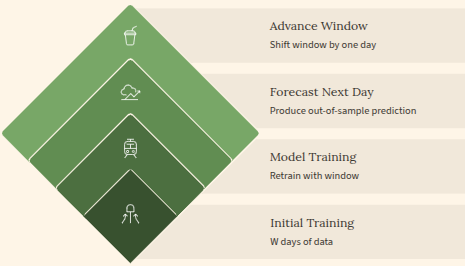
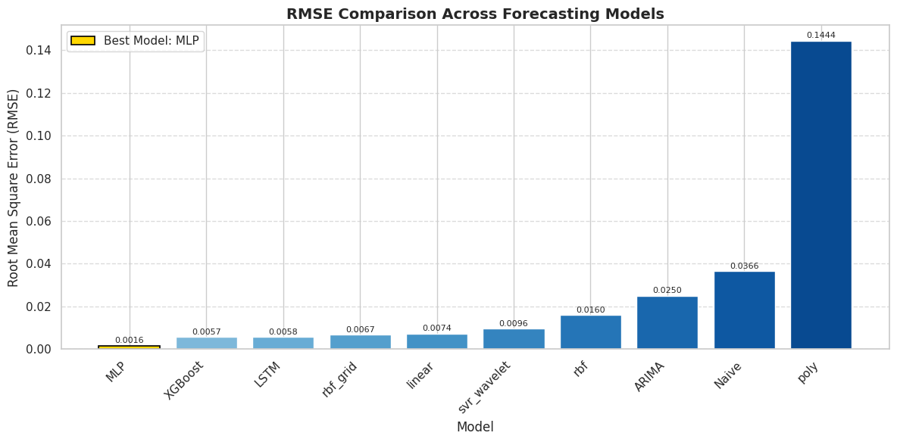
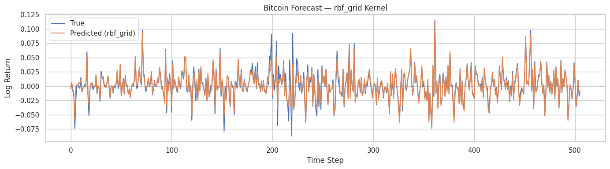
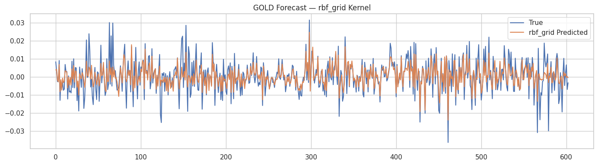
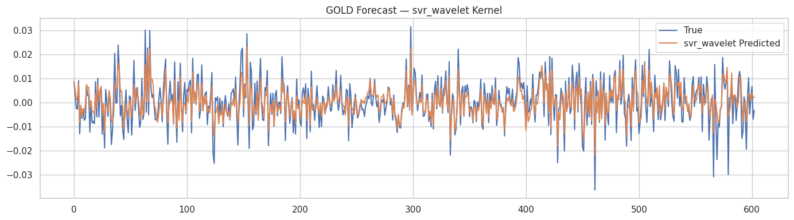
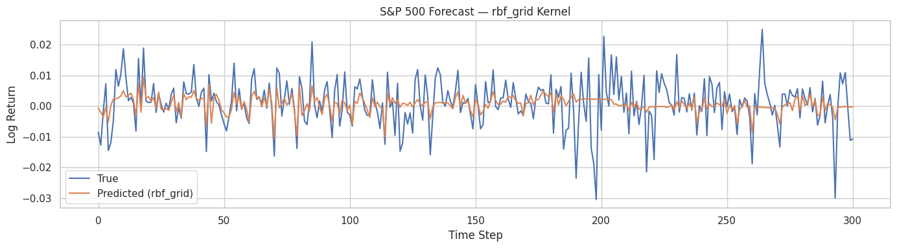

<div align="center">

# 📈 Support Vector Machines for Financial Time Series Forecasting
### Models, Techniques, and Performance Evaluation Across Financial Markets

[](https://python.org)
[](https://scikit-learn.org)
[](https://pytorch.org)
[](LICENSE)
[](#)

---

**Alex V Mutua**

📧 mutua.v.alex@aims-senegal.org  
African Institute for Mathematical Sciences (AIMS) — Senegal  
🎓 Master of Science in Data Science

</div>

---

# 📋 Abstract

Financial markets generate highly volatile and nonlinear time series that pose significant challenges for forecasting models. Classical econometric approaches such as ARIMA often struggle with nonlinear dependencies, while modern deep learning models require large datasets and substantial computational resources.

This thesis investigates the effectiveness of **Support Vector Regression (SVR)** for forecasting financial time series. Using a unified rolling-window framework, we compare SVR against classical benchmarks (ARIMA, Naive) and machine learning models (LSTM, MLP, XGBoost) across heterogeneous financial markets including **cryptocurrencies, equities, and commodities**.

Our results demonstrate that **tuned RBF-SVR achieves strong forecasting performance and robust directional accuracy**, offering a computationally efficient alternative to deep learning methods for moderate-sized financial datasets.

> **Keywords:** Support Vector Regression · Financial Forecasting · Machine Learning · Time Series · Rolling Window Evaluation

---

# 📑 Table of Contents

- [Introduction](#introduction)
- [Research Objective](#research-objective)
- [Data Sources](#-data-sources)
- [Methodology](#-methodology)
- [Quantitative Results](#-quantitative-results)
- [Results and Visualizations](#-results-and-visualizations)
- [Support Vector Regression](#-support-vector-regression-svr)
- [Repository Structure](#-repository-structure)
- [Future Work](#-future-work)
- [References](#-references)
- [License](#-license)
- [Acknowledgements](#-acknowledgements)
- [Declaration](#-declaration)

---

# Introduction

Forecasting financial markets is a complex task due to **volatility, nonlinear dynamics, and structural changes** in market behavior. Traditional statistical models such as ARIMA rely on linear assumptions and may struggle to capture nonlinear dependencies present in financial data.

Machine learning models provide flexible frameworks capable of modeling complex relationships. Among these methods, **Support Vector Regression (SVR)** offers a powerful approach that balances predictive performance with computational efficiency.

This research evaluates SVR within a unified experimental framework and compares it against classical and deep learning models across different financial markets.

---

# 🎯 Research Objective

The central goal of this study is to evaluate whether **Support Vector Regression provides a robust and interpretable alternative to deep learning models for financial time series forecasting**.

Key questions addressed include:

1. How does SVR perform relative to classical econometric models?
2. How sensitive is SVR performance to kernel choice and hyperparameters?
3. Can SVR generalize across different financial asset classes?
4. What trade-offs exist between SVR and deep learning models?

---
# 📐 Support Vector Regression (SVR)

Support Vector Regression is derived from Support Vector Machine theory and adapts the concept of maximum margin learning for regression tasks.

Instead of minimizing squared error, SVR fits a function that **remains as flat as possible while allowing small deviations controlled by an ε-insensitive loss function**.

---

## SVR Geometry: ε-Insensitive Tube

<p align="center">

</p>

### Interpretation

- The regression function is constrained to lie within an **ε-insensitive tube**.
- Errors inside the tube are ignored.
- Points outside the tube introduce **slack variables**.
- The regularization parameter **C** balances model flatness and tolerance to prediction errors.

---

## Mathematical Formulation

SVR solves the optimization problem:

```
$$
\min_{w,b,\xi_i,\xi_i^*} \quad \frac{1}{2} \|w\|^2 + C \sum_{i=1}^{n} (\xi_i + \xi_i^*)
$$
```

Subject to:

```
$$
\begin{aligned}
y_i - (w \cdot x_i + b) &\leq \varepsilon + \xi_i \\
(w \cdot x_i + b) - y_i &\leq \varepsilon + \xi_i^* \\
\xi_i, \xi_i^* &\geq 0, \quad i = 1, \dots, n
\end{aligned}
$$
```
Model Definition
```
$$
f(x) = w \cdot x + b
$$
```

Where:

| Symbol | Meaning |
|------|---------|
| w | weight vector |
| b | bias term |
| C | regularization parameter |
| ε | width of the insensitive tube |
| ξᵢ | slack variables |

---

## Why SVR for Financial Forecasting?

SVR is particularly suitable for financial time series because:

- It handles **nonlinear relationships through kernel functions**
- It performs well on **small to medium-sized datasets**
- The **ε-insensitive loss improves robustness to market noise**

In this thesis, the **Radial Basis Function (RBF) kernel** is primarily used.

---
# 📊 Data Sources

Financial market data used in this study are retrieved dynamically from **yfinance**, which provides programmatic access to historical data from Yahoo Finance.

The analysis covers three representative financial markets:

| Asset | Market Type | Ticker | Period |
|------|-------------|--------|--------|
| Bitcoin | Cryptocurrency | BTC-USD | 2016–2024 |
| S&P 500 | Equity Index | ^GSPC | 2010–2024 |
| Gold ETF | Commodity | GLD | 2010–2024 |

These assets were selected to represent **heterogeneous financial environments**, allowing the evaluation of forecasting models across different market regimes, liquidity levels, and volatility structures.

Because the datasets are retrieved programmatically at runtime, **no raw datasets are stored in this repository**, ensuring that experiments remain lightweight and fully reproducible.

Example data retrieval:

```python
import yfinance as yf
import numpy as np

ASSET = "BTC-USD"

btc = yf.download(ASSET, start="2016-01-01", end="2024-12-31")[["Close"]].dropna()
btc["LogReturn"] = np.log(btc["Close"] / btc["Close"].shift(1))
```

---

# ⚙️ Methodology

The forecasting framework follows four main stages.

## Feature Engineering

Features used in the models include:

- Log returns
- Lagged returns
- Rolling volatility
- Momentum indicators
- Wavelet decomposition

---

## Forecasting Models

The following models were evaluated:

- Support Vector Regression (SVR)
- ARIMA
- Naive benchmark
- LSTM
- MLP
- XGBoost

---
### Rolling Window Evaluation

All models were evaluated using a **rolling-window forecasting procedure**, which mimics real-world financial prediction where models are repeatedly retrained as new data arrives.

<p align="center">

</p>

**Procedure**

1. Train the model on a fixed historical window.
2. Predict the next observation (one-step-ahead forecast).
3. Move the window forward by one time step.
4. Retrain the model and repeat the process.

This evaluation framework ensures that model performance is measured on **true out-of-sample data**, avoiding look-ahead bias and providing a realistic assessment of forecasting ability.

---

## Performance Metrics

| Metric | Description |
|------|-------------|
| MAE | Mean Absolute Error |
| RMSE | Root Mean Squared Error |
| DA | Directional Accuracy |

---

# 📊 Quantitative Results

The forecasting models were evaluated using the three key metrics described above.

---

## ₿ Bitcoin (BTC-USD) Results

| Model | MAE | RMSE | DA |
|------|------|------|------|
| Naive | 0.0273 | 0.0366 | 0.4641 |
| ARIMA | 0.0177 | 0.0250 | 0.5099 |
| RBF-SVR (Grid) | 0.0040 | 0.0067 | 0.9267 |
| XGBoost | 0.0041 | 0.0057 | 0.9374 |
| MLP | **0.0012** | **0.0016** | **0.9771** |

### Interpretation

- SVR significantly improves over classical benchmarks such as Naive and ARIMA.
- Machine learning models capture nonlinear market dynamics more effectively.
- Deep learning models achieve the lowest raw prediction error.

---

## 📈 S&P 500 Results

| Model | MAE | RMSE | DA |
|------|------|------|------|
| Naive | 0.0084 | 0.0108 | 0.4956 |
| ARIMA | 0.0059 | 0.0078 | 0.5689 |
| RBF-SVR (Grid) | 0.0047 | 0.0067 | 0.7367 |
| XGBoost | 0.0018 | 0.0024 | 0.9267 |
| LSTM | **0.0006** | **0.0007** | **0.9622** |


---

## 🪙 Gold (GLD) Results

| Model | MAE | RMSE | DA |
|------|------|------|------|
| ARIMA | 0.0070 | 0.0092 | 0.5279 |
| LSTM | 0.0067 | 0.0087 | 0.6423 |
| SVR Wavelet | 0.0036 | 0.0046 | 0.8306 |
| RBF-SVR (Grid) | 0.0038 | 0.0053 | 0.8272 |
| XGBoost | **0.0022** | **0.0030** | **0.9229** |

---

# 📈 Results and Visualizations

The following figures summarize the forecasting performance of the proposed models across different financial assets.  
All experiments were evaluated using a **rolling-window forecasting framework**, ensuring that predictions simulate real-world financial forecasting conditions.

Model performance is primarily assessed using **Root Mean Squared Error (RMSE)** together with visual comparisons between predicted and actual log returns.

---

## ₿ Bitcoin Forecasting Results

### Best Model RMSE Comparison

<p align="center">

</p>

This figure compares the RMSE values of the best-performing models for **Bitcoin return forecasting**.

The results show that **machine learning approaches significantly outperform classical statistical models** such as Naive and ARIMA.  
Among the SVR variants, the **RBF kernel with optimized hyperparameters** provides strong predictive accuracy and competitive performance relative to more complex models.

---

### SVR with RBF Kernel (Grid Search Optimization)

<p align="center">

</p>

This visualization illustrates the **forecasted versus actual log returns for Bitcoin** using a Support Vector Regression model with an **RBF kernel**.

Hyperparameters were optimized using **grid search**, allowing the model to effectively capture nonlinear dependencies in cryptocurrency price movements.  
The rolling-window evaluation demonstrates that the SVR model maintains **stable predictive performance across different market regimes**.

---

## 🪙 Gold Forecasting Results

### SVR with RBF Kernel

<p align="center">

</p>

For the **gold market**, the SVR model with an optimized **RBF kernel** demonstrates strong forecasting capability.

The model successfully captures nonlinear relationships present in commodity price movements and produces predictions that closely track the actual return dynamics observed in the rolling evaluation period.

---

### SVR with Wavelet Kernel

<p align="center">

</p>

This experiment incorporates **wavelet-based feature decomposition** prior to applying Support Vector Regression.

Wavelet transformations allow the model to capture **multi-scale temporal structures** present in financial time series, enabling improved representation of both short-term fluctuations and long-term market trends.  
As a result, the **Wavelet-SVR approach demonstrates enhanced forecasting performance** for gold price dynamics.

---

## 📊 S&P 500 Forecasting Results

### SVR with RBF Kernel (Grid Search)

<p align="center">

</p>

For the **equity market represented by the S&P 500 index**, the optimized **RBF-kernel SVR model** provides stable predictive performance.

The results demonstrate that Support Vector Regression can effectively capture **nonlinear relationships and volatility structures** commonly observed in equity market returns.  
Compared with classical econometric approaches, SVR shows **clear improvements in both prediction accuracy and directional forecasting performance**.

---

# 📂 Repository Structure

```
SVR-Financial-Forecasting
│
├── Figures
│   ├── Bitcoin_RMSE_Best_Model.png
│   ├── Bitcoin_SVR_RBF_Grid_Kernel.png
│   ├── Gold_SVR_Rbf_Grid_Kernel.png
│   ├── Gold_SVR_Wavelet_Kernel.png
│   ├── Rolling_Window.png
│   ├── S&P_500_RBF_Grid_Kernel.png
│   └── SVR_GEometry_Tube.png
│
├── README.md
└── LICENSE
```

---

# 🚀 Future Work

Potential extensions of this research include:

- Multivariate financial forecasting
- High-frequency trading data
- Hybrid SVR–deep learning architectures
- Portfolio optimization applications

---

# 📚 References

Tay, F. E. H., & Cao, L. (2001).  
Application of Support Vector Machines in Financial Time Series Forecasting.

Singh, A., Singh, P., & Mishra, K. N. (2020).  
A Review on Support Vector Regression and its Applications.

---

# 📜 License

This project is released under the **MIT License**.

---


## 🙏 Acknowledgements

I am deeply grateful to **Almighty God** for His mercy, grace, love, and protection, which sustained me throughout this research journey.

I would like to express my sincere appreciation to my supervisor, **Dr. Ya'e Ulrich Gaba**, for his availability, insightful advice, patience, and continuous support. His constructive feedback and academic guidance were invaluable in shaping this dissertation.

I am particularly grateful to my tutor, **Mamadou Pathé Ly**, for his consistent guidance, encouragement, and dedication, which greatly supported me throughout the writing process.

My heartfelt appreciation goes to the **African Institute for Mathematical Sciences (AIMS Senegal)** for providing a stimulating academic environment that fostered both intellectual growth and personal development.

My sincere thanks go to my parents, **Abednego M. Musili** and **Christine M. Mutua**, and to my brothers, sister **Monicah Mutua**, and my friends for their unwavering support, prayers, encouragement, and belief in me. Their confidence and motivation have been a constant source of strength.

Finally, I extend my sincere gratitude to the lecturers, tutors, and staff members of the institution for their continued support and for providing an enriching academic environment throughout this journey.

---

## ✏️ Declaration

This work was carried out at **AIMS Senegal** in partial fulfilment of the requirements for a **Master of Science Degree**.

Except where due acknowledgement is made, I hereby declare that this work has **never been presented wholly or in part for the award of a degree** at AIMS Senegal or any other university.

**Author:** Alex Vundi Mutua  
**Supervisor:** Dr. Ya'e Ulrich Gaba  

<br>

<p align="center">

I, the undersigned, hereby declare that the work contained in this project is my original work, and that any work done by others or by myself previously has been properly acknowledged and referenced.

**Alex Vundi Mutua — February 15, 2026**

</p>

---

<p align="center">

Made with ❤️ at **AIMS Senegal**

</p>

<div align="center">

⭐ If you find this repository useful, please consider starring it!

</div>

